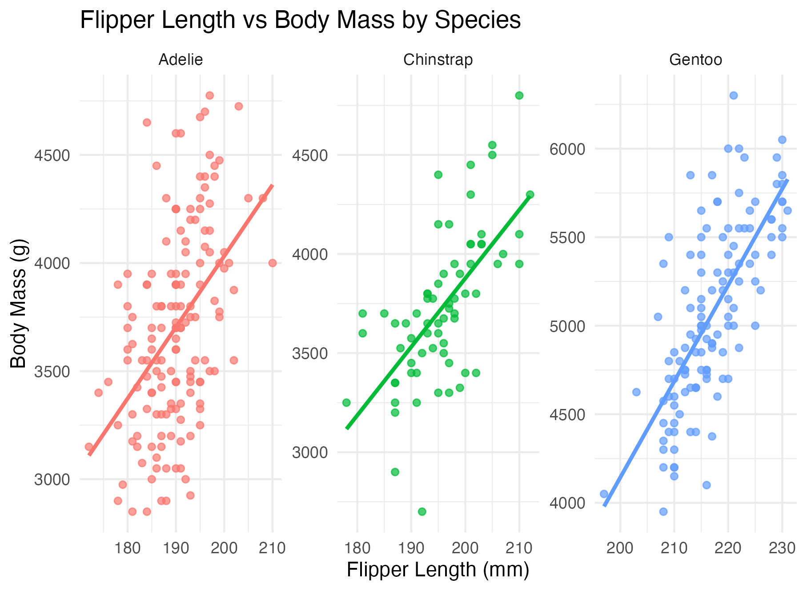

# Week 3 — Penguins Data Wrangling

Name: Mallory Collins
Course: BIOL 696 Graduate Research Workflows  
Instructor: Dr. Jan E. Janecka  
Semester: Spring 2026  

1. Which variables have missing data?
 bill length, bill depth, flipper length, body mass, and sex

2. Which variable has the highest percentage of missing values?
bill length, bill depth, flipper length, and body mass

3. Are there still missing values remaining?
no

4. Why might replacing missing values be preferable to removing rows?
maintains distribution of data

5. When might removing missing data still be the better choice?
Adding a value that is not consistent with the missing point, it may skew the data

6. How many observations remain after cleaning?
8

7. Which variables are numeric?
bill length, bill depth, flipper length, body mass, year

8. How many Chinstrap penguins are there?
68
9. How does this compare to the other species?
Adelie:152, Gentoo:124

10. What does body condition tell you that body mass alone does not?
also factors in flipper length, more descriptive can compare better between species

11. Based on body condition, how would you compare the relative “robustness” of the three species?
The Gentoos are ore robust since they have higher body coindition values

12. Is body condition more appropriate for comparing within species or between species? Explain your reasoning.
between species, since it is more representative of size than just the mass alone

13. Which species dominates the lowest body condition penguins?
Chinstrap

14. Which species has the highest median body mass?
Gentoo

15. Which species has highest variation in body condition?
Chinstrap

16. Are there any outliers? Which species do they belong to?
yes, Chinstrap

17. How do patterns in body mass compare to body condition?
The patterns between body mass and body condition are similar, with the Gentoos having the highest values and the Adelie and Chinstrap median both around the same values. However, the body condition plot recognizes a wider range of outlines and variation of data within species.

18. What is the relationship between flipper length and body mass within each species?
 flipper length increases with body mass
 
19. Do the slopes (trends) look similar across species, or do they differ?
all trends have a positive correlation between speciea

20. How does this relate to the body condition index you calculated earlier?
also supports that longer flipper length correlates to a higher body mass

21. Why might body condition be a more useful metric than body mass alone when comparing individuals?
Body takes into account the variation between species allowing for comparison between species

